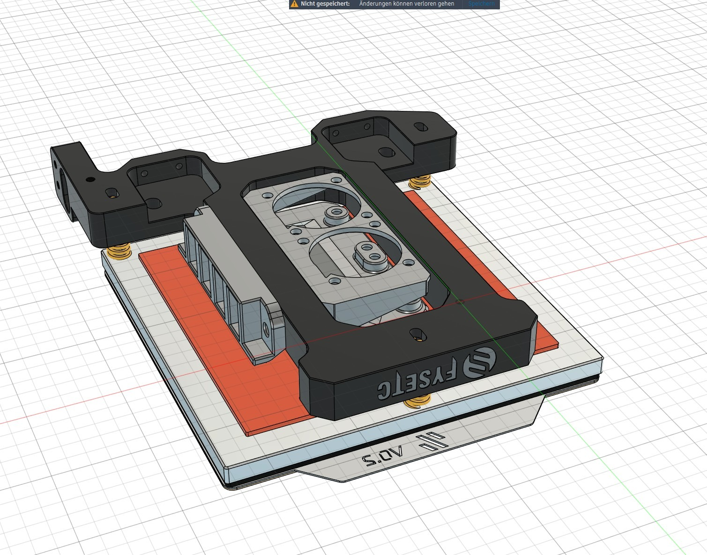

# V0 Bedfans Heatshield – Bedfan-Mount mit Hitzeschild für Voron V0 + Fysetc CNC Bedträger

**Deutsch** · [English](README.md)

> *Bedfans, die deinen Bett-Sensor in Ruhe lassen.*

Bedfan-Mount mit aufliegendem Hitzeschild, für den **Voron V0 mit Fysetc CNC Bedträger**. Drei Druckteile: ein Halter für zwei 3010er Blower, ein gegenüberliegender Wago-Halter und ein Hitzeschild direkt auf den Lüftern. Der Schild schließt nach oben ab und lässt ~3 mm seitlichen Spalt zur Heizmatte frei – die Luft tritt seitlich aus statt senkrecht nach oben gegen einen mittig sitzenden Bett-Thermistor zu blasen.

> *Inspired by the Voron V0 design (CC-BY-SA 4.0). All parts in this mod are own designs.*

---

## ⚠️ Kompatibilität

Passt und ergibt nur Sinn auf:

- **Voron V0** mit **Fysetc CNC Bedträger**
- **Heizmatte mit mittig sitzendem Thermistor** (z.B. Formbot V0-Kit-Matte)

Wenn dein Thermistor am Rand der Heizmatte sitzt, hast du das Problem, das dieser Mod löst, gar nicht.

---

## Das Problem

Standard-Bedfan-Mounts blasen die Luft direkt nach oben gegen die Heizmatten-Unterseite. Ein mittig sitzender Thermistor steht genau in diesem Luftstrom und meldet eine Temperatur deutlich unter der tatsächlichen Bett-Temperatur. Der Drucker heizt mit 100 % gegen, die gemessene Temperatur steigt aber nicht, und Klipper bricht ab mit `heater not heating at expected rate`.

Dieser Mod lenkt den Luftstrom seitlich um – mit einem Hitzeschild direkt auf den Lüftern. Der Thermistor bleibt aus dem Luftstrom raus, das Bett misst korrekt, und die Lüfter wälzen trotzdem die Kammerluft um. Heatsoak im V0 wird spürbar beschleunigt.

---

## Print-Settings

| Bereich | Wert |
|---|---|
| Material | **PC PBT GF** erforderlich – ABS/ASA ist bei dem Abstand zur Heizmatte grenzwertig. Creed PC PBT GF funktioniert gut. |
| Layer-Höhe | 0,2 mm |
| Wände | 4 |
| Top/Bottom Layers | 4 |
| Infill | 40 % |
| Druckgeschwindigkeit | **Eher langsam fahren** – PC PBT GF mag keine hohen Speeds |
| Stützen | Keine nötig – Geometrie ist support-frei |

---

## Bill of Materials

### Hardware

| Position | Menge |
|---|---|
| 3010 Blower Fan, 24 V (GDSTime empfohlen) | 2 |
| Wago 221-412 (2-polig) | 2 |

### Schrauben

| Typ | Menge | Verwendung |
|---|---|---|
| M3×20 Linsenkopf (BHCS, ISO 7380) | 2 | Sandwich-Befestigung – eine pro Seite |
| M3×16 Linsenkopf (BHCS, ISO 7380) | 8 | Hitzeschild-Stack – 4 pro Lüfter |

### Heat-Set Inserts

| Position | Menge |
|---|---|
| M3 im Fan-Halter (seitlich) | 2 |
| M3 im Hitzeschild (oben) | 8 |

---

## Montage

1. Heat-Set Inserts setzen: 2× M3 seitlich in den Fan-Halter, 8× M3 oben in den Hitzeschild (vier pro Lüfter-Position).
2. 2× 3010 Lüfter in den Fan-Halter einlegen.
3. Hitzeschild auf die Lüfter legen und **8× M3×16 BHCS von unten** durch Fan-Halter, durch die Eck-Bohrungen der Lüfter, in die Schild-Inserts schrauben. Dieser Stack hält die Lüfter im Halter und den Schild oben drauf.
4. Fan-Halter mittig in die Heizmatten-Aussparung des Fysetc CNC Bedträgers setzen, Wago-Halter gegenüberliegend.
5. **2× M3×20 BHCS** von außen am Wago-Halter durch die Bedträger-Bohrung in das M3-Insert im Fan-Halter schrauben. Eine pro Seite. Dieses Sandwich klemmt Wago-Halter, Bedträger und Fan-Halter zusammen – kein Gewindeschneiden ins Aluminium.
6. 2× Wago 221-412 in den Wago-Halter einsetzen.

Nach der Montage einmal langsam Z homen und prüfen, dass der Schild die Heizmatte nicht berührt. Designter Spalt: ~3 mm.

---

## Verkabelung

Die zwei 3010er werden über die Wagos an einen freien 24-V-Lüfter-Ausgang am Drucker geführt.

---

## Files

- [`/3MF`](3MF/) – `V0-Bedfans-Heatshield.3mf` (alle drei Bauteile in einer Datei)
- [`/STEP`](STEP/) – editierbar in jedem CAD
- [`/CAD`](CAD/) – Fusion 360 native mit vollem Parameterbaum

---

## Lizenz

[**CC-BY-SA 4.0**](LICENSE) – Standard im Voron-Ökosystem. Forks und Remixes gerne unter gleicher Lizenz.

---

## Credits

- **Design:** Wh'sFortune
- **Inspired by:** [Voron V0](https://docs.vorondesign.com) (CC-BY-SA 4.0)
- **Companion-Mods:** [Aegis Chamber](https://github.com/WhsFortune/Projekt-Aegis) · [Filtra](https://github.com/WhsFortune/filtra)

Issues und Feedback: gerne als GitHub Issue.
